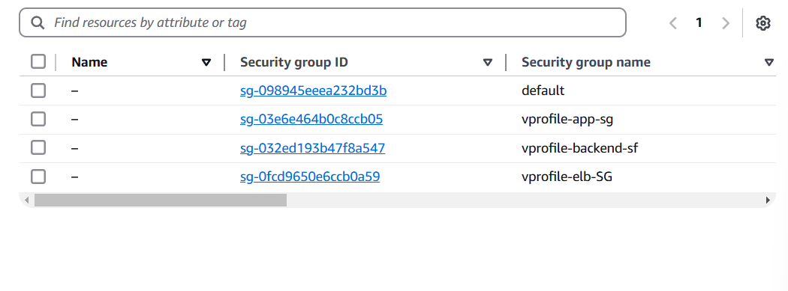
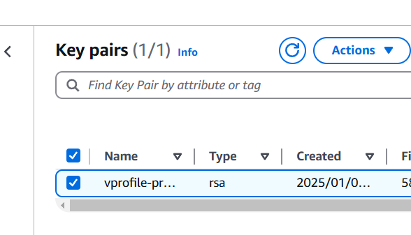
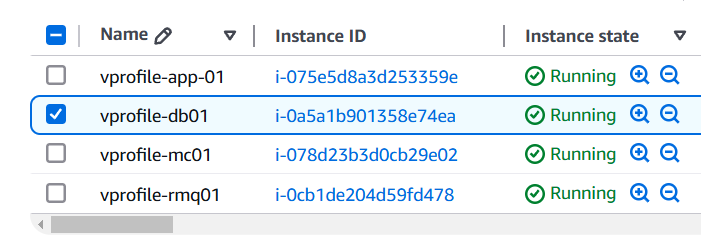
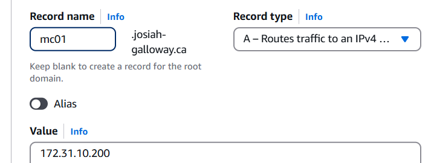
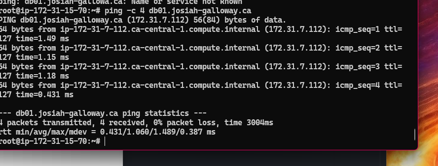
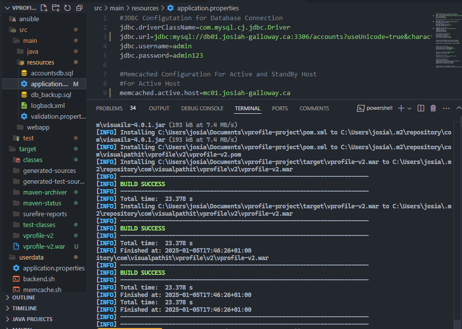
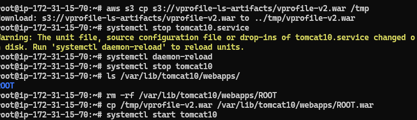
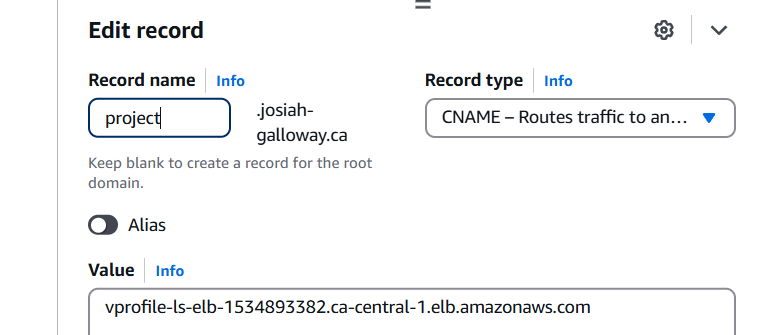
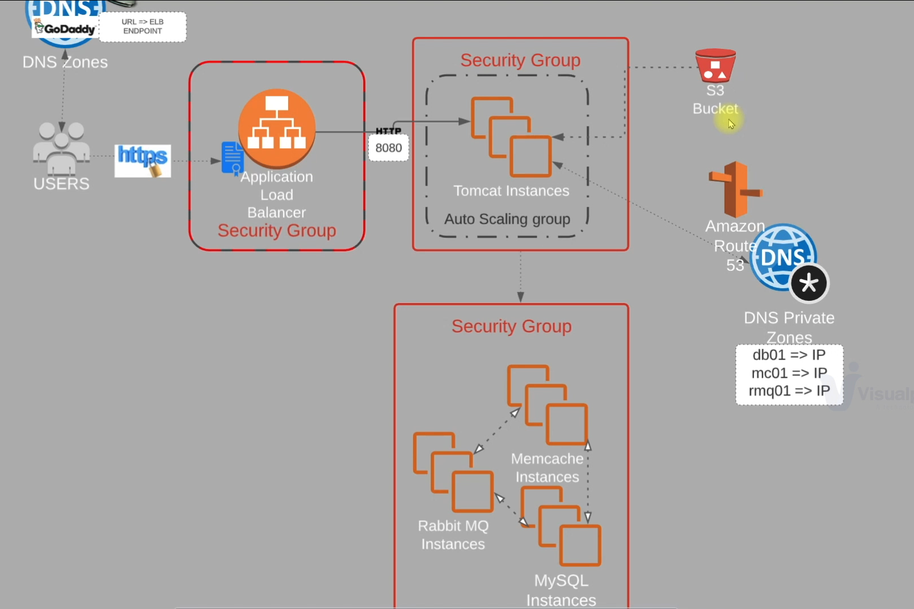

# Lift and Shift with AWS 

## 🚀 Overview
The purpose of this project is practice performing a lift and shift of an on premise multi tier application. Following the tutorial included in this [Udemy Course](https://www.udemy.com/course/devopsprojects/learn/lecture/23885400?start=195#content).

- **Key Skills:** Networking, AWS, Cloud Migration
- **Status:** Completed

## 🔧 Tools & Technologies
- **Tools:** Maven(for building the application), Bash (for provisioning scripts)
- **Cloud Provider:** AWS (EC2, ELB, Autoscaling, S3, EFS, Route53, Amazon Certificate Manager)

---
### Steps
1. Login to AWS account and setup the necessary security groups for vprofile application, backend and load balancer like so:

2. Fork and then clone the vprofile project repository:
   ```bash
   git clone https://github.com/hkhcoder/vprofile-project.git
   ```
3. Navigate to the directory:
   ```bash
   cd vprofile-project
   ```
4.  Switch branch to awsliftandshift:
   ```bash
       git checkout awsliftandshift
   ```

5. Created key pair for the application EC2 instances in order to ssh into them. Make sure to save it somewhere safe as if you lose the key you will have to create a new one. 

6. Navigate to the userdata folder in project repository. This is where all the shell scripts are located that will be used to configure our application EC2 instances. 
7. With the scripts I created all of the EC2 instances

8. Next I used ssh to connect to the instances using my key pair and confirmed that services were running.
9. After that it I had to create private DNS records for the internally resolve addresses of the instances. 

10. After creating all 4 records I can login to one of the instances and confirm I can ping all other instances to check if everything is working correctly. 

11. Next step is to build the application and upload it to an S3 bucket after changing the application properties to reflect the new DNS records in the previous step. 

12. Create an IAM role with ``AmazonS3FullAccess`` policy attached. Then add the role to the vprofile-app-01 instance. 
13. I then connected to the application instance and copied the application artifact from the s3 bucket. After that I stopped the tomcat service so that I can delete the default application and replace it with the vprofile application artifact. 

14. Temporarily added an inbound security group rule to allow traffic to port 8080 from my ip to confirm the application is working. 
15. After confirmation I can proceed to create a load balancer. This requires creating an instances target group first. 
16. Before creating the load balancer itself I had to create a new certificate for my domain to enable https. I previously had a certificate but it was created in a different amazon region which meant I could not use it without having to redeploy a lot of the application resources. With this new certificate I enabled https in the load balancer. 
17. The load balancer gives an endpoint that I added to my route53 hosted zone as a CNAME record. 

18. With this done I can now access the application with https.


## 🌐 Architecture

## 🚩 Future Improvements
- Write terraform code for the deployment. 
- Use a Cloud Native approach 

---

## 🙌 Acknowledgments
- [Udemy Devops Projects](https://www.udemy.com/course/devopsprojects/learn/lecture/23885400?start=195#content)

---
